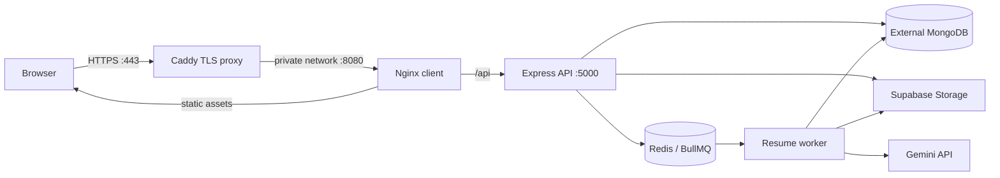
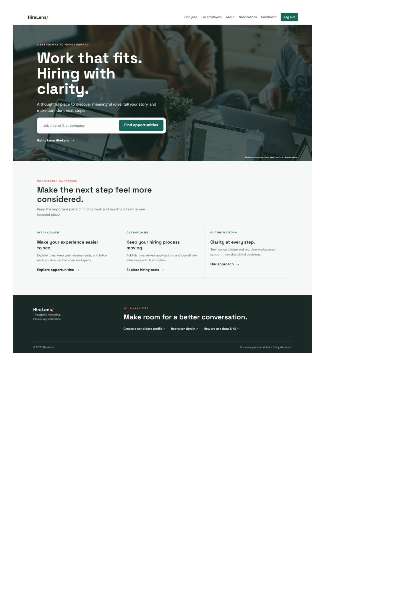
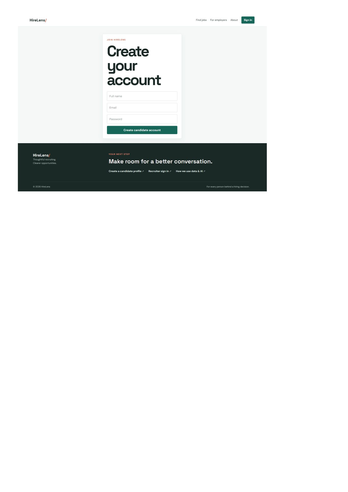
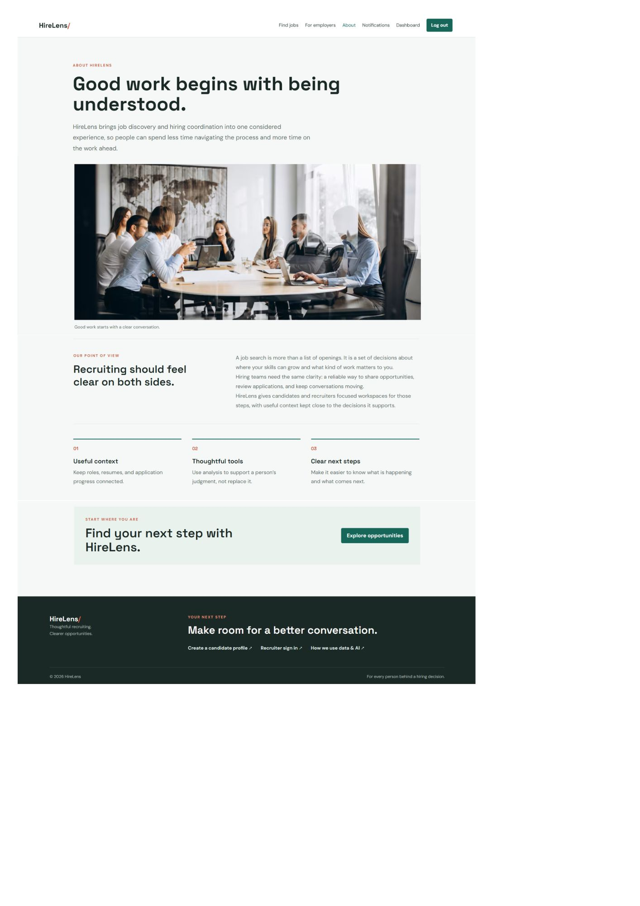
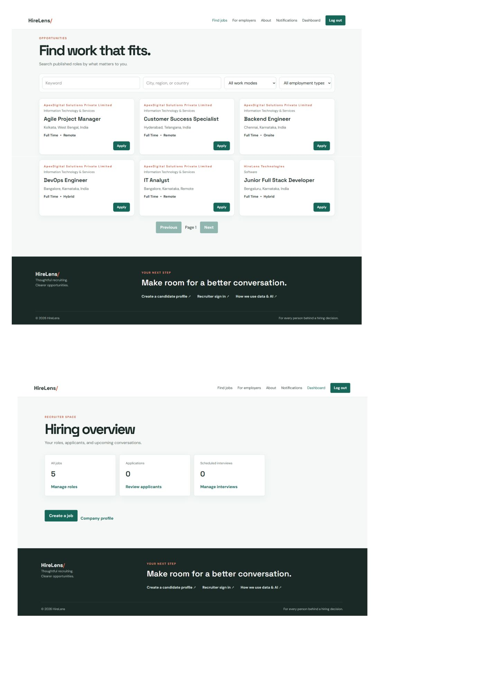
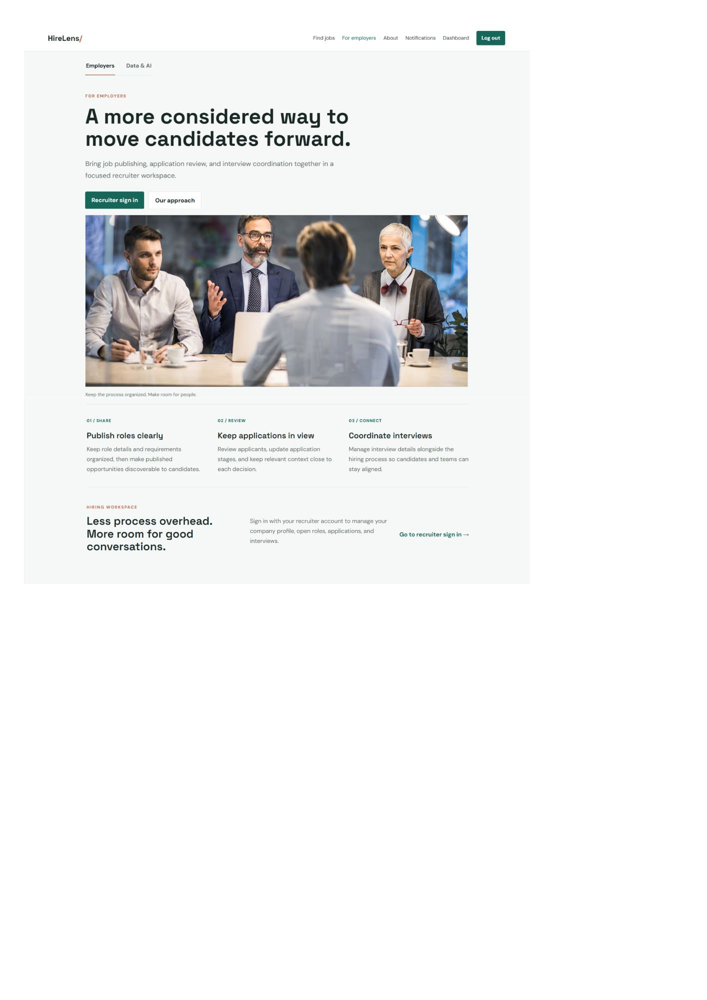

# HireLens

HireLens is an AI-assisted recruitment and applicant-tracking platform. Candidates can discover jobs, manage applications and interviews, and upload resumes. Recruiters manage company profiles and jobs, review applicants, and coordinate interviews. Administrators manage users and platform content.

AI features provide resume analysis and resume-job match assistance. They are decision-support tools, not hiring predictions or automated employment decisions.

## Problem it solves

Hiring workflows often scatter job discovery, applications, resume review, candidate communication, and interview scheduling across separate tools. HireLens brings those activities into one role-aware platform: candidates can track their applications, recruiters can manage job and applicant workflows, and administrators can oversee platform activity. Resume analysis and matching assist review, but do not make hiring decisions.

## Contents

- [Problem it solves](#problem-it-solves)
- [Key features](#key-features)
- [Tech stack](#tech-stack)
- [AI and resume pipeline](#ai-and-resume-pipeline)
- [Authentication and RBAC](#authentication-and-rbac)
- [Architecture](#architecture)
- [Deployment architecture](#deployment-architecture)
- [Project structure](#project-structure)
- [API overview](#api-overview)
- [Prerequisites](#prerequisites)
- [Docker setup](#docker-setup)
- [Local development](#local-development)
- [Environment variables](#environment-variables)
- [Create initial accounts](#create-initial-accounts)
- [Testing and verification](#testing-and-verification)
- [Screenshots](#screenshots)
- [Deployment](#deployment)
- [Security and operations](#security-and-operations)
- [Future improvements](#future-improvements)
- [Troubleshooting](#troubleshooting)
- [Project documentation](#project-documentation)
- [License](#license)

## Key features

- Candidate, recruiter, and administrator roles with role-based access control
- Public job search, job details, saved jobs, and applications
- Recruiter company profiles, job publishing, applicant review, and status history
- Interview scheduling and in-app notifications
- Resume upload to private Supabase Storage and short-lived signed resume links
- Asynchronous resume extraction and AI-assisted analysis using Redis, BullMQ, and Gemini
- Candidate-facing resume-job match assistance

## Tech stack

| Area                  | Technology                                                            |
| --------------------- | --------------------------------------------------------------------- |
| Client                | React 19, TypeScript, Vite, React Router, TanStack Query, Axios       |
| API                   | Node.js 22, Express 5, TypeScript, Zod                                |
| Data                  | MongoDB with Mongoose                                                 |
| Authentication        | JWT, bcrypt                                                           |
| Resume storage        | Supabase Storage                                                      |
| Background processing | Redis, BullMQ, separate Node.js worker                                |
| AI                    | Google Gemini API                                                     |
| Web serving           | Nginx for the client container; Caddy for production TLS and proxying |
| Containers and CI     | Docker Compose, GitHub Actions                                        |

## AI and resume pipeline

1. A candidate uploads a PDF or DOCX resume. The API accepts files up to 5 MB and stores the object in a private Supabase Storage bucket.
2. The API creates or updates a resume-analysis record and queues work through Redis and BullMQ.
3. The worker downloads the private object, extracts text with `pdf-parse` or `mammoth`, and normalizes the extracted text.
4. The worker sends the resume text to Gemini with instructions to use only supplied information and not infer protected traits or predict hiring outcomes.
5. The response is parsed and validated against a structured schema. Analysis results and processing status are saved in MongoDB; failed work is retried according to queue settings.
6. The client displays candidate-facing analysis and matching assistance. Recruiters access application resumes only when authorized, through short-lived signed URLs.

Resume-job matching is also available through application endpoints. AI output is informational support for candidates and recruiters; it is not an automated screening or hiring decision. Resume text is sent to the configured AI provider, so configure candidate notices, consent, retention, and provider terms appropriately before production use.

## Authentication and RBAC

- Registration and login are provided under `/api/auth`; login returns a signed JWT and the user's role.
- The client sends the token as an `Authorization: Bearer` header. The current client stores the token in browser `localStorage`.
- API middleware verifies token claims and recognizes `CANDIDATE`, `RECRUITER`, and `ADMIN` roles.
- Role middleware restricts recruiter and administrator routes. Services also enforce ownership rules for user-specific records and recruiter-owned jobs/applicants.
- The admin router requires authentication and the `ADMIN` role for every route.

Because browser `localStorage` is accessible to JavaScript, an XSS vulnerability could expose a stored token. Keep dependencies and client rendering secure; moving authentication to Secure, HttpOnly cookies with an appropriate CSRF strategy is a possible future improvement.

## Architecture

```text
Browser -> React client -> Express API -> MongoDB
															|             -> Supabase Storage
															|             -> Redis/BullMQ -> Resume worker -> Gemini
```

The API and worker are separate Node.js services. MongoDB and Supabase are external services. Docker Compose runs Redis, the API, worker, and client; it does not start MongoDB. The client serves the React build and proxies `/api` requests to the API.

## Deployment architecture

The checked-in production deployment is Docker Compose on a Docker host. Caddy is the public HTTPS entry point. The client is bound to loopback on the host and the API and Redis are not published as host ports.



MongoDB is provisioned separately. The architecture guide also describes a possible CloudFront/ALB/ECS deployment, but that cloud-provider deployment is not currently configured; see [docs/architecture.md](docs/architecture.md) and [docs/deployment.md](docs/deployment.md).

## Project structure

```text
client/                 React/Vite application and Nginx configuration
	src/api/              API client and Axios setup
	src/components/       Shared UI components
	src/context/          Authentication context
	src/pages/            Public and workspace pages
	src/routes/           Route guards
	src/types/            Shared client types
server/                 Express API
	src/config/            Database, Redis, and Supabase configuration
	src/controllers/       HTTP request handlers
	src/middleware/        Authentication, roles, validation support, uploads
	src/models/            Mongoose models
	src/queues/            Background queue producers
	src/routes/            API routes
	src/services/          Business logic
	src/scripts/           Admin and recruiter seed scripts
worker/                  BullMQ resume-processing worker
	src/jobs/              Queue job processors
	src/services/          Resume extraction and AI services
deploy/                  Caddy configuration
docs/                    API, architecture, development, and deployment guides
.github/workflows/       CI and image-build preparation workflows
docker-compose*.yml      Local and production Compose configuration
```

## API overview

All API routes are under `/api`; successful responses generally use `{ success, message, data }`. The health endpoint is `GET /api/health`.

| Route group           | Main operations                                                                     |
| --------------------- | ----------------------------------------------------------------------------------- |
| `/api/auth`           | Register, login, current-user lookup                                                |
| `/api/profile`        | Candidate profile read/update                                                       |
| `/api/profile/resume` | Resume upload, read/delete, analysis status/results                                 |
| `/api/company`        | Recruiter company profile create/read/update                                        |
| `/api/jobs`           | Public job listing/search/details; recruiter job create/update/publish/close/delete |
| `/api/applications`   | Apply, review applications, update status/history, resume access, match assistance  |
| `/api/saved-jobs`     | Candidate saved-job list/add/remove                                                 |
| `/api/interviews`     | Create, list, update, and cancel interviews                                         |
| `/api/notifications`  | List notices and mark them as read                                                  |
| `/api/admin`          | Platform statistics and user/job/company/application administration                 |

See [docs/api.md](docs/api.md) for more endpoint details and access rules.

## Prerequisites

- Node.js 22 and npm for local development
- Docker Engine/Desktop with the Docker Compose plugin for container workflows
- A MongoDB database and connection URI
- A Supabase project with a **private** Storage bucket for resumes (default bucket name: `resumes`)
- A Gemini API key for AI resume features
- Redis for queued resume processing; Compose runs Redis for you

The server requires MongoDB, a JWT secret, and Supabase configuration. The worker requires MongoDB, Redis, Supabase, and Gemini configuration.

## Docker setup

From the repository root, create the Compose environment file:

```powershell
Copy-Item .env.example .env
```

Edit `.env` and provide at least `MONGODB_URI`, `JWT_SECRET`, `SUPABASE_URL`, `SUPABASE_SERVICE_ROLE_KEY`, `SUPABASE_RESUME_BUCKET`, and `GEMINI_API_KEY`. The full stack includes the worker, so it needs all of its configuration. Keep the Supabase service-role key server-side; never use it as a client `VITE_*` variable.

Start the local stack:

```powershell
docker compose up --build
```

Open the client at <http://localhost:4173>. The client binds to loopback by default. The API health endpoint is available internally at `/api/health`; browser API requests go through the client proxy. MongoDB is external, and Redis data is stored in the `redis-data` named volume.

To stop the stack, press `Ctrl+C` or run `docker compose down` from the repository root. `docker compose down -v` also deletes named volumes and should only be used when you intend to remove persisted Redis data.

## Local development

For direct development, configure each app separately. The root `.env` file is for Compose; it is not automatically loaded by the server or worker when run from their own directories.

In PowerShell, create local environment files from the examples:

```powershell
Copy-Item server/.env.example server/.env
Copy-Item worker/.env.example worker/.env
Copy-Item client/.env.example client/.env
```

Fill in the required values. In `server/.env`, set `MONGODB_URI`, `JWT_SECRET`, `SUPABASE_URL`, and `SUPABASE_SERVICE_ROLE_KEY`. In `worker/.env`, also set `REDIS_URL` and `GEMINI_API_KEY`; point `REDIS_URL` at a running Redis instance. The client example uses `http://localhost:5000/api`. Keep the server's `CLIENT_URL` set to the client origin, typically `http://localhost:5173`.

Install dependencies once in each package directory:

```powershell
cd server
npm ci
cd ..\worker
npm ci
cd ..\client
npm ci
```

Run each service in its own terminal from its package directory:

```powershell
# Terminal 1, from server/
npm run dev

# Terminal 2, from worker/
npm run dev

# Terminal 3, from client/
npm run dev
```

Vite prints the client URL, normally <http://localhost:5173>. For frontend-only work, the server and worker may be stopped, but API-backed flows require the configured services.

## Environment variables

| Variable                                                  | Used by                    | Purpose                                                                                                                          |
| --------------------------------------------------------- | -------------------------- | -------------------------------------------------------------------------------------------------------------------------------- |
| `PORT`                                                    | Server                     | API port; defaults to `5000`                                                                                                     |
| `NODE_ENV`                                                | Server, worker             | Runtime environment; use `production` for production                                                                             |
| `CLIENT_URL`                                              | Server                     | Allowed browser origin or comma-separated origins; production value must match the public site origin and have no trailing slash |
| `MONGODB_URI`                                             | Server, worker             | MongoDB connection string                                                                                                        |
| `JWT_SECRET`                                              | Server                     | JWT signing key; production requires at least 32 characters, and a randomly generated secret is recommended                      |
| `REDIS_URL`                                               | Server, worker             | Redis connection; Compose defaults to `redis://redis:6379`                                                                       |
| `SUPABASE_URL`                                            | Server, worker             | Supabase project URL                                                                                                             |
| `SUPABASE_SERVICE_ROLE_KEY`                               | Server, worker             | Private server-side Supabase Storage access key                                                                                  |
| `SUPABASE_RESUME_BUCKET`                                  | Server, worker             | Private resume bucket name; normally `resumes`                                                                                   |
| `GEMINI_API_KEY`                                          | Worker, server AI features | Gemini API access for resume analysis and match assistance                                                                       |
| `VITE_API_URL`                                            | Client build               | API base URL; local default is `http://localhost:5000/api`, Compose uses `/api`                                                  |
| `DOMAIN`                                                  | Production Compose/Caddy   | Public DNS name for HTTPS                                                                                                        |
| `ACME_EMAIL`                                              | Production Compose/Caddy   | Email used for TLS certificate registration                                                                                      |
| `ADMIN_NAME`, `ADMIN_EMAIL`, `ADMIN_PASSWORD`             | Admin seed script          | Initial administrator account values                                                                                             |
| `RECRUITER_NAME`, `RECRUITER_EMAIL`, `RECRUITER_PASSWORD` | Recruiter seed script      | Initial recruiter account values                                                                                                 |

Environment templates are available at the repository root and in `server/`, `worker/`, and `client/`. Do not commit populated `.env` files or put private credentials in frontend variables.

## Create initial accounts

Set the account variables and MongoDB URI in `server/.env`, then run the seed scripts from `server/`:

```powershell
npm run seed:admin
npm run seed:recruiter
```

The scripts create the account only if the email does not already exist. Use strong unique passwords, and do not use seeded development credentials in production. Protect and remove production seed credentials after account creation.

## Testing and verification

Run the server and worker tests and builds from their respective directories, and build the client:

```powershell
cd server
npm ci
npm test
npm run build

cd ..\worker
npm ci
npm test
npm run build

cd ..\client
npm ci
npm run build
```

The client package currently defines a production build but no test script. CI runs server and worker tests, builds all three packages, validates production Compose configuration, and builds the Docker images. To check the production Compose configuration locally, populate the production variables and run:

```powershell
docker compose -f docker-compose.yml -f docker-compose.prod.yml config --quiet
```

Before a release, also build the production images and smoke-test the integrated stack using the steps in [docs/deployment.md](docs/deployment.md). CI does not connect to live MongoDB, Supabase, or Gemini services and does not replace production smoke testing.


## 📸 Screenshots

### Home Page


### Login Page


### About


### Dashboard


### Jobs


### Employers page


### Data AI page


## Deployment

Production Compose is intended for a Docker host with a public DNS name. Configure MongoDB network restrictions and backups, a private Supabase resume bucket, production secrets, and the values listed in the environment table. Point DNS to the host and allow inbound ports 80 and 443. Caddy obtains and renews TLS certificates and proxies to the client; do not expose the API or Redis ports publicly.

Start and inspect the production stack:

```powershell
docker compose -f docker-compose.yml -f docker-compose.prod.yml up -d --build
docker compose -f docker-compose.yml -f docker-compose.prod.yml ps
```

Before public launch, configure centralized logs and health alerts, back up MongoDB and the Redis volume, and test restoration. Smoke-test registration/login, role access, job creation and applications, interviews, resume upload/processing/download/removal, and AI matching. Publish organization-reviewed terms and privacy information, including contact details, retention periods, and applicable privacy rights.

The repository does not currently select a cloud provider or automatically deploy images. The GitHub deploy-preparation workflow only builds images; see [docs/deployment.md](docs/deployment.md) for detailed production steps and operational notes.

## Security and operations

- The API uses Helmet, a configured CORS origin allowlist, Zod request validation, a 1 MB JSON body limit, and authentication rate limiting (30 requests per 15 minutes).
- Resume uploads are limited to PDF and DOCX files up to 5 MB.
- Keep Supabase service-role credentials and all other secrets on the server/worker only.
- Keep the resume bucket private; resume access uses short-lived signed URLs.
- Restrict MongoDB network access to trusted hosts and enable automated backups.
- Keep the API and Redis private to the Compose network; expose only the HTTPS entry point in production.
- Use unique, strong passwords for administrator and recruiter accounts.
- Review retention, deletion, privacy, and legal requirements before accepting real candidate data.

## Future improvements

- Configure a target registry and hosting provider, then extend the image-build workflow into a protected deployment pipeline.
- Add client unit/component tests and browser end-to-end tests for candidate, recruiter, and administrator journeys.
- Add centralized logs, alerting, automated backup verification, and documented restore drills.
- Evaluate Secure, HttpOnly cookie authentication and CSRF protections instead of persisting bearer tokens in `localStorage`.
- Define and publish privacy, consent, retention, and deletion policies for resumes and AI processing.
- Add accessibility checks and ongoing security/dependency scanning to CI.

## Troubleshooting

| Symptom                                         | Check                                                                                                                     |
| ----------------------------------------------- | ------------------------------------------------------------------------------------------------------------------------- |
| Compose reports a required variable is missing  | Fill in the root `.env`; production Compose additionally requires `DOMAIN` and `ACME_EMAIL`.                              |
| API exits during startup                        | Check `MONGODB_URI`, `JWT_SECRET`, `SUPABASE_URL`, and `SUPABASE_SERVICE_ROLE_KEY`; inspect `docker compose logs server`. |
| Worker repeatedly restarts                      | Check MongoDB, Redis, Supabase, and `GEMINI_API_KEY`; inspect `docker compose logs worker`.                               |
| Browser cannot reach the API in local Vite mode | Confirm the API is running on port 5000 and `client/.env` has `VITE_API_URL=http://localhost:5000/api`.                   |
| Client port 4173 is already in use              | Change `CLIENT_PORT` in the root `.env`.                                                                                  |
| Resume operations fail                          | Confirm the configured Supabase bucket exists and is private, and that the service-role key has access.                   |
| Production TLS is not issued                    | Confirm `DOMAIN` resolves to the host, ports 80/443 are reachable, and `ACME_EMAIL` is valid.                             |

Useful Compose commands:

```powershell
docker compose ps
docker compose logs -f server worker client
docker compose config
```

## Project documentation

- [API overview](docs/api.md)
- [Architecture](docs/architecture.md)
- [Development setup](docs/development.md)
- [Deployment guide](docs/deployment.md)

## License

There is currently no root-level `LICENSE` file, so this repository does not yet state a project-wide open-source license. The server package's `package.json` lists `ISC`, but package metadata alone does not establish the license for the entire repository. Choose and add a root license before redistributing the project; do not assume reuse rights from this README.
